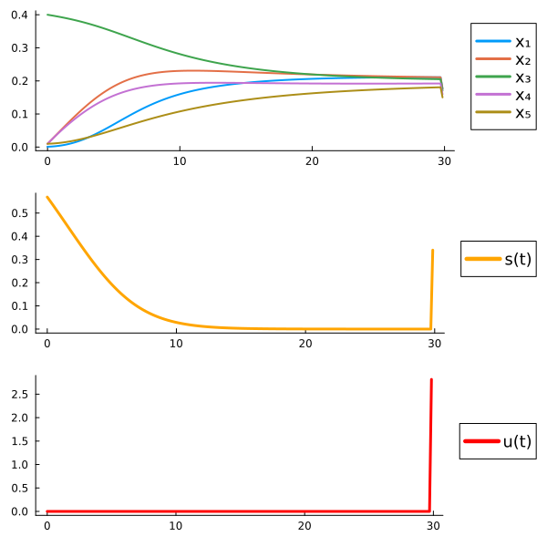
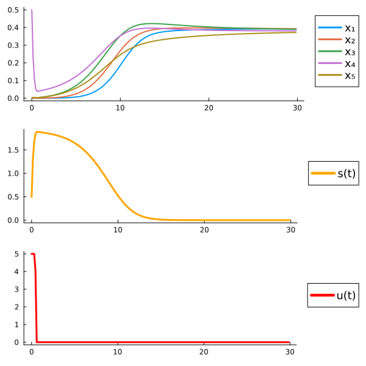
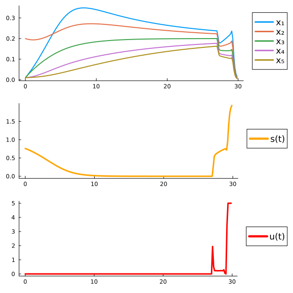
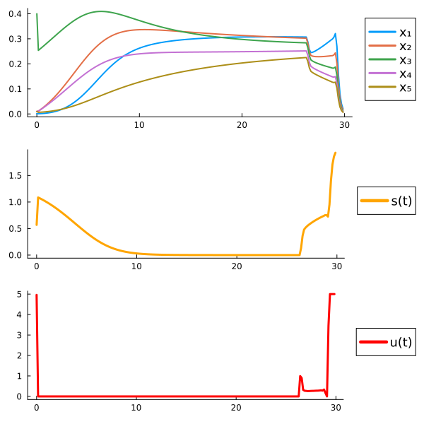
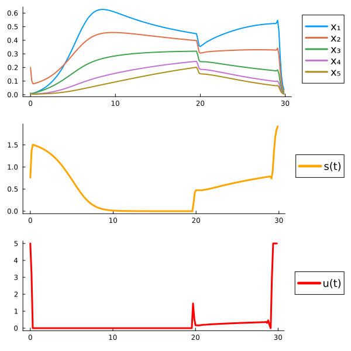
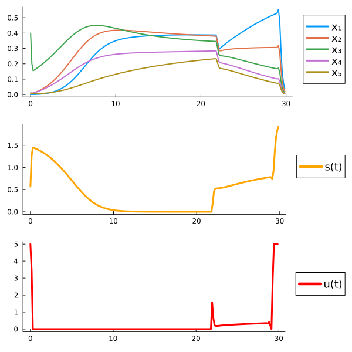
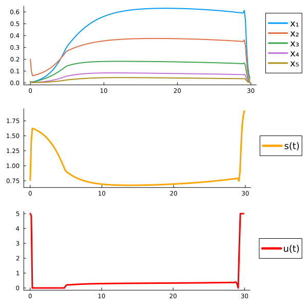
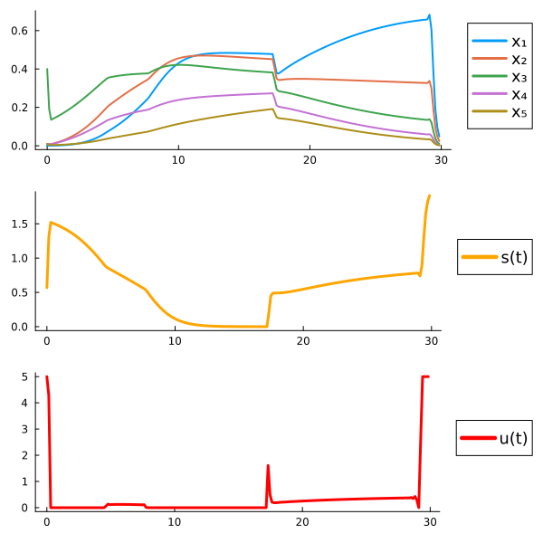
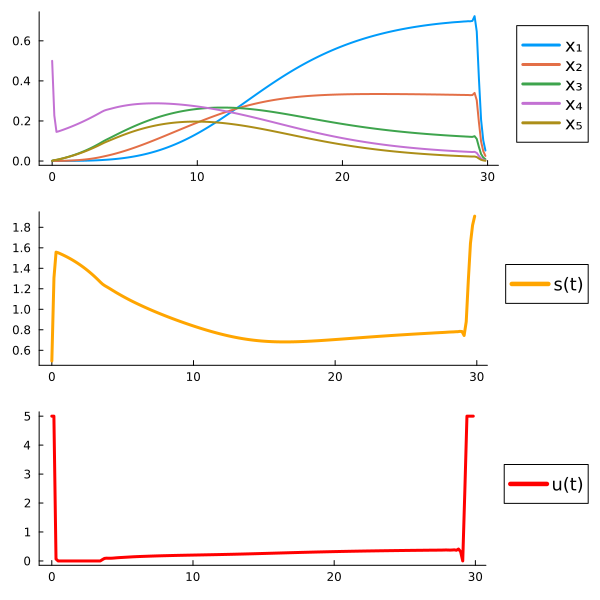
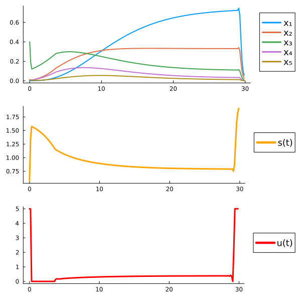

### Optimal control problem: Max biodiversity and production

* ### α = 1.0

ε   x₀|0.1  (0.150,0.20,0.20,0.20,0.100)|0.1  (0.001,0.01,0.40,0.010,0.010)|0.1  (0.001,0.001,0.001,0.5,0.001)
:------:|:-------------------------------:|:-------------------------------:|:-------------------------------:
  -- |   |    |   

* ### α = 0.8

ε  x₀|0.1  (0.150,0.20,0.20,0.20,0.100)|0.2  (0.010,0.20,0.010,0.010,0.01)|0.1  (0.001,0.01,0.40,0.010,0.010)
:------:|:-------------------------------:|:-------------------------------:|:-------------------------------:
  -- |   |   |   

  * ### α = 0.6

ε  x₀|0.1  (0.150,0.20,0.20,0.20,0.100)|0.2  (0.010,0.20,0.010,0.010,0.01)|0.1  (0.001,0.01,0.40,0.010,0.010)
:------:|:-------------------------------:|:-------------------------------:|:-------------------------------:
  -- |   |   |   

  * ### α = 0.5

ε  x₀|0.1  (0.150,0.20,0.20,0.20,0.100)|0.2  (0.010,0.20,0.010,0.010,0.01)|0.1  (0.001,0.01,0.40,0.010,0.010)
:------:|:-------------------------------:|:-------------------------------:|:-------------------------------: 
  -- |   |   |   

  * ### α = 0.4

ε  x₀|0.1  (0.150,0.20,0.20,0.20,0.100)|0.1  (0.001,0.01,0.40,0.010,0.010)|0.1  (0.001,0.001,0.001,0.5,0.001)
:------:|:-------------------------------:|:-------------------------------:|:-------------------------------:
  -- |   |   |   

  * ### α = 0.0

ε  x₀|0.1  (0.150,0.20,0.20,0.20,0.100)|0.1  (0.001,0.01,0.40,0.010,0.010)|0.1  (0.001,0.001,0.001,0.5,0.001)
:------:|:-------------------------------:|:-------------------------------:|:-------------------------------:
  -- |   |   |   