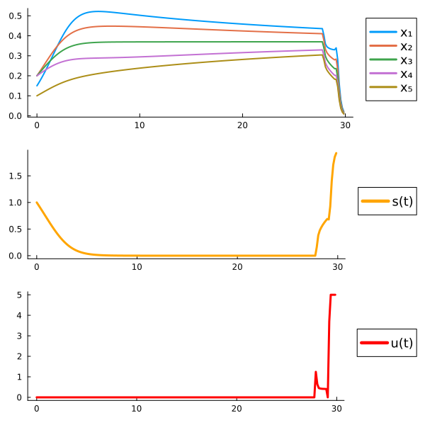
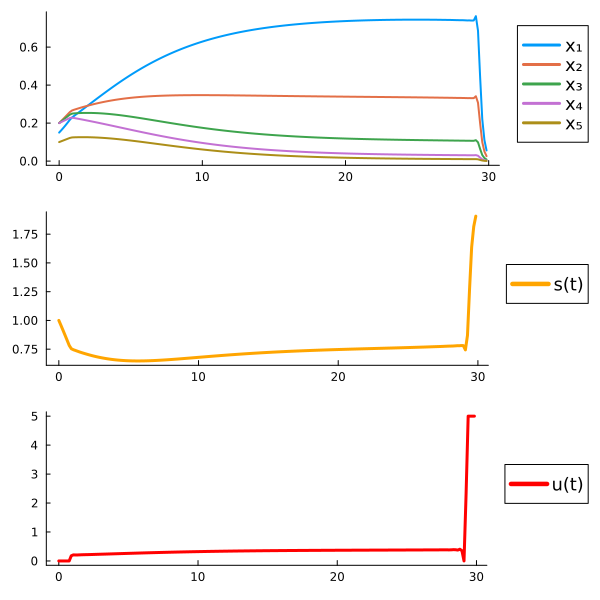
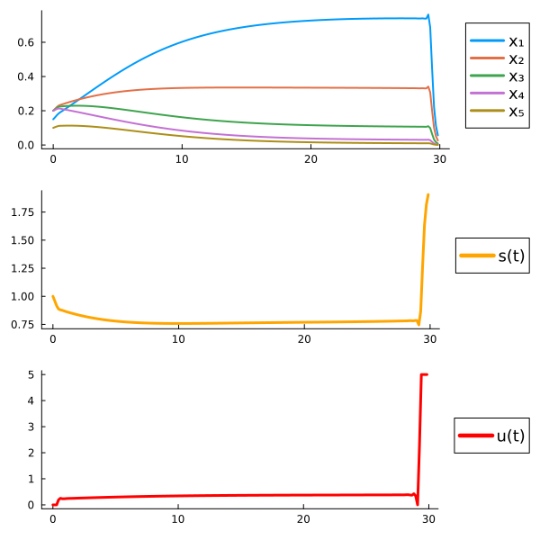
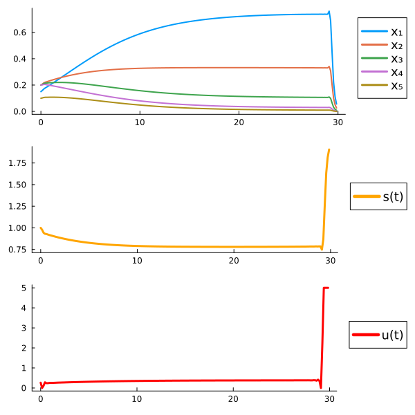

### Optimal control problem: Max biodiversity and production

* α = 1.0, ε = 0.1

$x_0=(0.0,0.0,0.0,0.0,0.0)$|$x_0=(0.0,0.0,0.0,0.0,0.0)$|$x_0=(0.0,0.0,0.0,0.0,0.0)$
:-------------------------------:|:-------------------------------:|:-------------------------------:
  |   |   

  

* α = 0.9, ε = 0.1
  
  

* α = 0.8, ε = 0.1
  
 

* α = 0.7, ε = 0.1
  
 

* α = 0.6, ε = 0.1
  
 

* α = 0.5, ε = 0.1
  
 

* α = 0.4, ε = 0.1
  
 

 * α = 0.3, ε = 0.1
  
 

 * α = 0.2, ε = 0.1
  
 

* α = 0.1, ε = 0.1
  
 

* α = 0.0, ε = 0.1
  
 
